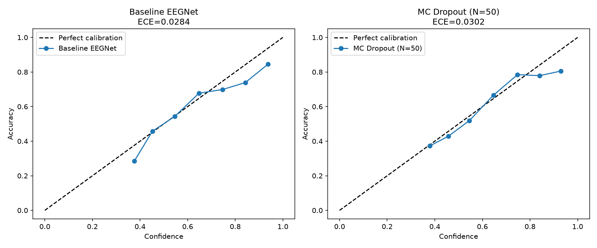

# NeuroMCP

An MCP server that gives AI agents a read on your cognitive state in real time.
Before surfacing a finding, the agent checks your EEG stream. If you are focused, it backs off.
If you are at rest, it gives you everything.

---

## The Problem

AI agents are optimized to be thorough, not timely. If you are in the middle of tracking down a
memory leak and your code review agent decides that now is the moment to deliver a three-paragraph
security finding, you will either miss it, skim it, or context-switch at exactly the wrong time.
The agent has no way to know it chose the worst possible moment.

Brain-computer interface research has shown for decades that motor imagery states, resting state,
and cognitive load each produce distinct, measurable EEG signatures. The question is whether that
signal can be made available to any agent at inference time, with calibrated uncertainty, over a
standard protocol.

That is what this is.

---

## Demo

_[Recording coming. Run it yourself using the instructions below.]_

NeuroMCP runs a real-time EEG signal pipeline, decodes motor imagery state using EEGNet with
Monte Carlo dropout, and exposes two tool calls over the Model Context Protocol:

- `get_signal_quality()` returns artifact ratio, signal-to-noise, and epoch count
- `get_brain_state(confidence_threshold)` returns decoded state with calibrated confidence

A focus-gated code review agent demonstrates the pattern. It calls both tools before each finding.
When the decoded state is LEFT or RIGHT imagery (the operator is mentally engaged), the agent
surfaces a one-sentence summary. When the state is REST, it gives full detail. The agent also
respects its own uncertainty: when confidence is below the threshold, it rechecks before acting.

---

## Architecture

```
┌─────────────────────────────────────────────────────────────┐
│                        MCP Server                           │
│   get_brain_state() -> {state, confidence, timestamp}        │
│   get_signal_quality() -> {snr, artifact_ratio, epoch_count} │
└────────────────────┬────────────────────────────────────────┘
                     │
┌────────────────────▼────────────────────────────────────────┐
│                    Neural Decoder                           │
│   EEGNet + Monte Carlo Dropout (N=50) -> calibrated probs   │
│   States: LEFT_IMAGERY | RIGHT_IMAGERY | REST               │
└────────────────────┬────────────────────────────────────────┘
                     │
┌────────────────────▼────────────────────────────────────────┐
│                  Signal Pipeline                            │
│   Streaming windowing -> bandpass filter (8-30 Hz)         │
│   -> artifact rejection -> epoch buffer                     │
│   (daemon threads; MCP tool calls read from the buffer)     │
└─────────────────────────────────────────────────────────────┘
```

A `PlaybackThread` feeds recorded EEG at the original 160 Hz sample rate into a `PipelineThread`
that applies an 8-30 Hz Butterworth bandpass, windows the signal into 1-second epochs (50% overlap),
and rejects artifacts above 200 µV peak-to-peak. Clean epochs are written into a thread-safe
circular buffer. The MCP server reads from that buffer on each tool call, running N=50 stochastic
forward passes through EEGNet for `get_brain_state()`.

> **Note:** This project uses the PhysioNet EEGBCI dataset as a proxy for live input. It is a
> research-grade demonstration of the interface pattern, not production BCI software.

---

## Calibration

**Why calibration matters here.** A model that reports 85% confidence while being right only 60%
of the time will trip the confidence gate at the wrong moments. An overconfident model is worse
than no gating at all, because it appears to be working while silently making the wrong call.

We measured Expected Calibration Error on a cross-subject held-out test set (subjects 81-109,
1695 epochs, trained on subjects 1-80). Baseline EEGNet: 2.84% ECE. MC Dropout (N=50): 3.02% ECE.
They are statistically equivalent.



The model's mean confidence across the held-out set is 59.1% against a measured accuracy of 57.6%,
a gap of 1.5 percentage points. When the model says it is 70% confident, it is right about 70%
of the time. That is what the reliability curves above show.

The reason EEGNet is already well-calibrated without correction is the training configuration:
dropout=0.5 is a strong regularizer that prevents the network from concentrating too much
probability mass on any single class. There is no overconfidence for MC dropout to fix.
What Monte Carlo dropout provides here is not calibration improvement but a per-prediction
confidence estimate derived from sampling the weight posterior across 50 forward passes, rather
than a single-shot softmax output. That gives the agent a principled basis for the confidence
threshold, and it allows the variance of those 50 predictions to be inspected if needed.

---

## Results

Measured on a cross-subject split (train: subjects 1-80, test: 81-109).

| Metric | Value |
|--------|-------|
| Test accuracy (3-class, chance 33%) | 57.6% |
| ECE, baseline EEGNet | 2.84% |
| ECE, MC Dropout (N=50) | 3.02% |
| `get_brain_state` latency (Apple Silicon, N=50) | ~27 ms |

Cross-subject motor imagery decoding is a hard problem. 57.6% on a 3-class task with no
subject-specific fine-tuning, no data augmentation, and a 16K-parameter model is in line with
published results for subject-independent EEGNet on PhysioNet EEGBCI. The accuracy figure is
honest. The calibration figure is what makes the confidence gate trustworthy.

---

## Setup

```bash
pip install -e ".[dev]"
```

PhysioNet EEGBCI data downloads automatically via MNE on first run.

Create a `.env` file in the project root with your Anthropic API key (required for the demo agent):

```
ANTHROPIC_API_KEY=your_key_here
```

---

## Training

EEGNet is small (about 16K parameters). Training on all 80 subjects runs locally on Apple Silicon
in a few minutes. No cloud GPU required.

```bash
python -m src.models.train \
  --subjects $(seq 1 80) \
  --test-subjects $(seq 81 109) \
  --epochs 200 \
  --out checkpoints/
```

To find the best demo subject from the test set:

```bash
python scripts/screen_subjects.py --checkpoint checkpoints/eegnet.pt
```

---

## Running the Demo

```bash
python -m src.demo.agent \
  --checkpoint checkpoints/eegnet.pt \
  --subject 86 \
  --run 4
```

See [docs/demo-script.md](docs/demo-script.md) for a full walkthrough with expected output,
talking points, and recording tips.

---

## Running the Server Standalone

```bash
python -m src.server.server \
  --checkpoint checkpoints/eegnet.pt \
  --subject 86 \
  --run 4
```

Any MCP-compatible agent can then call `get_signal_quality()` and `get_brain_state()`.

---

## Tests

```bash
pytest
```

35 tests covering the signal pipeline, EEGNet architecture, MC dropout decoder, and MCP server schemas.

---

## Where This Goes

The interface pattern here is protocol-level. Because `get_brain_state()` is a standard MCP
tool call, any compatible agent can use it without any EEG-specific knowledge. The code review
application is the simplest demonstration of that idea.

**Passive versus active adaptation.** The current agent adapts verbosity using a static confidence
threshold. A natural extension is a model that learns the operator's typical focus patterns across
a session and adjusts dynamically, less like a threshold and more like a collaborator that has
spent time learning when to talk.

**Richer state spaces.** Motor imagery left/right/rest is one of the better-studied EEG paradigms,
but it is not the only available signal. P300, SSVEP, and frontal alpha asymmetry each encode
different cognitive states. A richer state space means richer adaptation, and potentially a more
fine-grained picture of what the operator can handle at any given moment.

**Real hardware.** This project uses recorded data as a proxy for live input. Running it on a
consumer BCI device (Emotiv, OpenBCI, Muse) would change the noise floor significantly. The
pipeline's artifact threshold and bandpass were tuned on PhysioNet data; live hardware would
need recalibration. The calibration step above would be a good place to start.

**Latency budget.** 27 ms per `get_brain_state()` call with N=50 passes on Apple Silicon is
well within typical MCP round-trip overhead. Profiling on constrained hardware would matter
for embedded or mobile applications.

The long-term question is not whether agents can read brain state. That part mostly works. The
harder question is what they should do with it, how to act on ambiguous signals, and how to
earn the operator's trust that the adaptation is actually helping. This is an early interface
for that problem.
